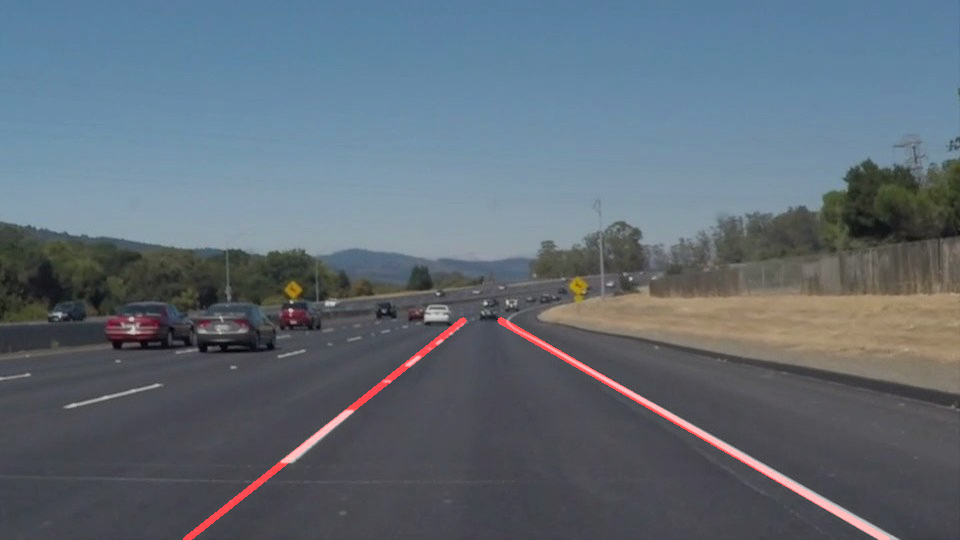
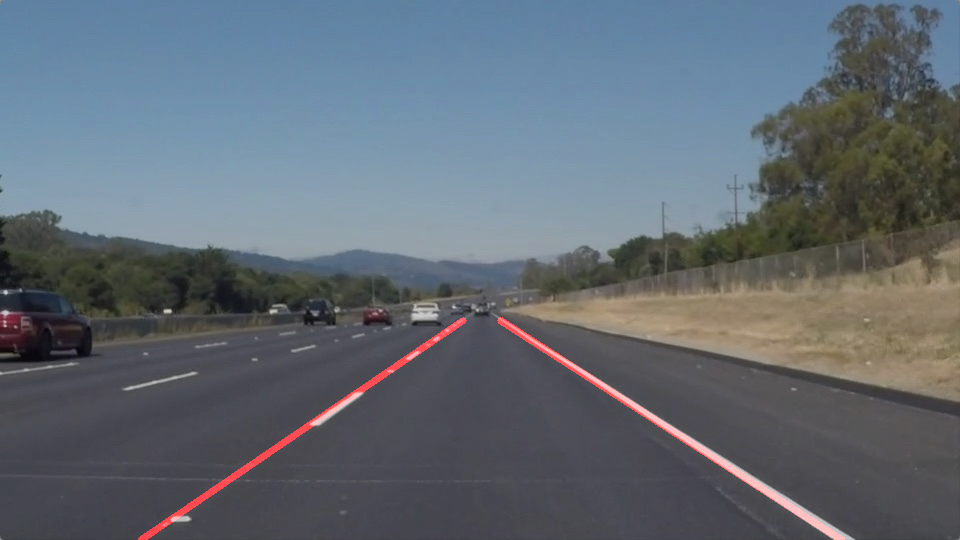
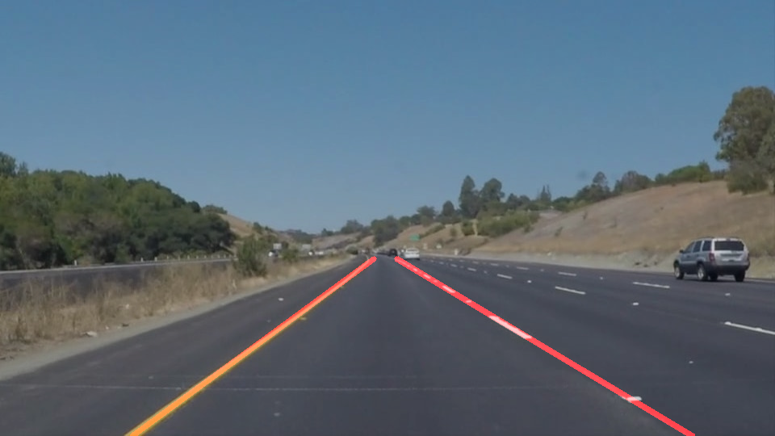
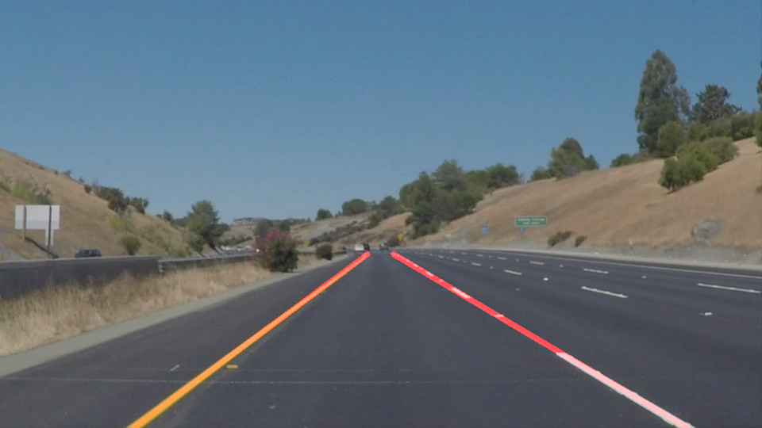
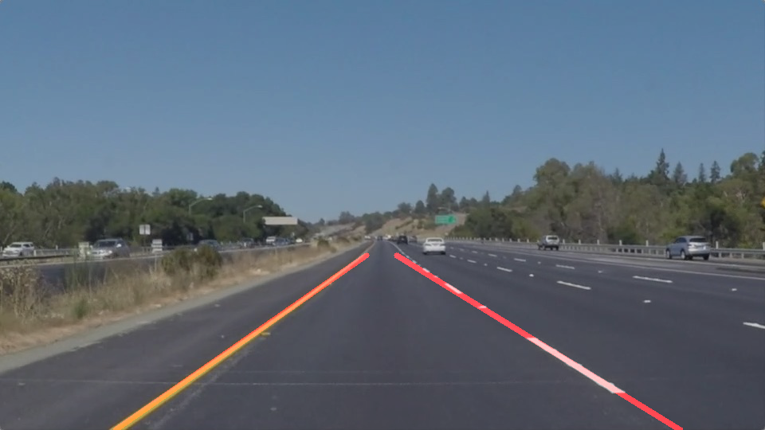
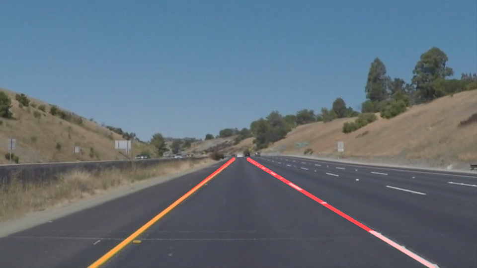

# **Finding Lane Lines on the Road** 

## Writeup Template

### You can use this file as a template for your writeup if you want to submit it as a markdown file. But feel free to use some other method and submit a pdf if you prefer.

---

**Finding Lane Lines on the Road**

The goals / steps of this project are the following:
* Make a pipeline that finds lane lines on the road
* Reflect on your work in a written report

[//]: # (Image References)

[image1]: ./examples/grayscale.jpg "Grayscale"

---

### Reflection

### 1. Describe your pipeline. As part of the description, explain how you modified the draw_lines() function.

My pipeline is defined in function: process_image_in which consisted of 6 steps:
  * converted the images to grayscale,
  * call the _gaussian_blur_ with _kernel_size_ = 3
  * then call the _canny_ function to find all edges, with _low_threhold_ = 50 and _high_threhold_ = 150
  * defines the 4 vertices for region of interest, and then apply the region to the image returned by _canny_
  * Use the _hough_lines_ to detects all the lines with following paramters:
      * rho = 1
      * theta = np.pi/180
      * threshold = 15
      * min_line_length = 40
      * max_line_gap = 20
      
  * call the image draw function _weighted_img_    

#### drawing single line on left and right lanes:
In order to draw a single line on the left and right lanes, a function _extrpo_v2_ is created to return the four vertices. then the **_draw_lines_** takes these four vertices and draw on image.

The four vertices are calaculated in **_extrapo_v2_** function:
* first use slope _w = -(y2-y1)/(x2-x1)_ to calculate the slope. Note here minus is used because I am used to negative y below x axis and makes the caculation map to math function easily.
* calculate the line _length = (x2-x1)**2 + (y2-y1)**2_
* slope w < 0  belongs to left lane, caculate the offset b to origin
* slope w > 0 belongs to right line, caculate the offset b to origin
* only count the lines that length is > 5000
* average the slope w and offest b
* given the lane top and bottom, caculate the lefe lane's two ends
* given the lane top and bottom, caculate the right lane's two ends
* return the four vertices for the draw_line to draw.

Following are the output image of test images:

### **solidWhiteCurve.jpg**

### **solidWhiteRight.jpg**

### **solidYellowCurve.jpg**

### **solidYellowCurve2.jpg**

### **solidYellowLeft**

### **whiteCarLaneSwitch.jpg**

The video output is at:
[test_videos_output](./test_videos_output)

### 2. Identify potential shortcomings with your current pipeline

One potential shortcoming would be when there some images have scattered lines out side of left/right lanes which can cause the w and b not so continous such as the drawed lines does not land properly on the lane.

secondly, if the line length 5000 defined in extrpo_v2 is too big, certain image could be skipped due to no line obtained. it can be set to lower value to count for all images but will run into above first issue

Also a linearregression model was tried to fit the points to draw a better line, but it seems not working as expected. 

### 3. Suggest possible improvements to your pipeline

A possible improvement would be try to use other curve and line fit algorithm to get closer and smooth line draw.

Another potential improvement could be to dynamically find the region of interests when detect lanes. currently the fixed region does not work for all conditions and need to manually to change them for new curve road condition.
